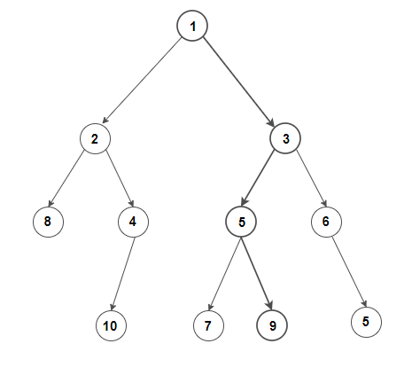

# java interview questions

Interview questions solved in Java.

1. [Exercise 1 - Find second max](#exercise-1)
2. [Exercise 2 - Count `i -j == list[i] - list[j]`](#exercise-2)
3. [Exercise 3 - URL Tracking Parameters](#exercise-3)
4. [Exercise 4 - Load Balancer](#exercise-4)
5. [Exercise 5 - Coin Change](#exercise-5)
6. [Exercise 6 - Word Pattern](#exercise-6)
7. [Exercise 7 - Pattern Searching](#exercise-7)
8. [Exercise 8 - Find maximum sum root to leaf path in a binary tree](#exercise-8)
9. [Exercise 9 - Sliding window maximum](#exercise-9)
10. [Exercise 10 - How frequently each range occurs](#exercise-10)
11. [Exercise 11 - Get the maximum word count in a text file](#exercise-11)
12. [Exercise 12 -Find the largest positive integer](#exercise-12)
13. [Exercise 13 - URL Shorten](#exercise-13)

## Exercise 1

#### Description

Find the second max number in a list of integer.

##### Signature:

```java
Integer find2Max(ArrayList<Integer> list);
```

##### Scenario 1

- Input {}
- Output: Exception

##### Scenario 2

- Input {1,2,3}
- Output 2

## Exercise 2

#### Description

Find the number of times the following conditions became true in a list of integer.

```
i -j == list[i] - list[j]
```

##### Signature:

```java
Integer count(ArrayList<Integer> list);
```

##### Scenario 1

- Input {}
- Output: Exception

##### Scenario 2

- Input {1,2,3}
- Output 9
- Description: 9 times
    - If `i = 0, j = 0`
    - If `i = 1, j = 1`
    - If `i = 2, j = 2`
    - If `i = 0, j = 1`
    - If `i = 1, j = 0`
    - If `i = 1, j = 2`
    - If `i = 2, j = 1`
    - If `i = 0, j = 2`
    - If `i = 2, j = 0`

## Exercise 3

#### Description

URL Tracking Parameters

When sharing links to social media, URLs must be modified to ensure engagement and/or visitors
can be associated with that particular social page or post. Publishers will typically add URL query
parameter key-value pairs with keys of utm_source, utm_medium and utm_campaign. These
key-value pairs are represented as `[key]=[value]` in the URL, and multiple pairs are separated
by an ampersand `&`.

Create a java implementation that can update a URL given the required tracking parameters and whether such new
parameters should be added in the query or fragment component.
Existing parameters should be left unchanged, i.e. remain in either query or fragment

##### Additional requirements:

1. The input URL may already contain any number of query and fragment parameters,
   including none, that must be preserved in the resulting URL, unless overwritten by new
   parameters with the same key.
2. The same “key” cannot exist in both query and fragment URL components. If there is such
   a conflict, prioritise the newer parameter location.
3. The value of a key-value pair may be empty. In such cases include the key but omit the “=”
   (e.g. https://example.com?key1=value1&key2&key3=value3)

##### Scenario 1

- Input - URL: `https://www.telegraph.co.uk/theatre/what-to-see/renaming-colston-hall-dreary-failure-imagination/`
- Input - key-value:

| Key          | Value     |
|--------------|-----------|
| utm_source   | Facebook  |
| utm_campaign | test      |
| utm_medium   | Social    |

- Output `https://www.telegraph.co.uk/theatre/what-to-see/renaming-colston-hall-dreary-failure-imagination/?
  utm_source=Facebook&utm_campaign=test&utm_medium=Social`

## Exercise 4

#### Description

Create a load balancer with the following requirements:

- Register instances
    - It should be possible to register an instance, identified by an address.
    - Each address should be unique, it should not be possible to register the same address more than once.
    - Load balancer should accept up to 10 addresses.
- Random invocation
    - Develop an algorithm that, when invoking the Load Balancer's get() method multiple times, should return one
      backend-instance choosing between the registered ones randomly.

## Exercise 5

ou are given an integer array `coins` representing coins of different denominations and an integer amount representing a
total amount of money.

Return the fewest number of coins that you need to make up that amount. If that amount of money cannot be made up by any
combination of the coins, return `-1`.

You may assume that you have an infinite number of each kind of coin.

##### Example 1:

```
Input: coins = [1,2,5], amount = 11
Output: 3
Explanation: 11 = 5 + 5 + 1
```

##### Example 2:

```
Input: coins = [2], amount = 3
Output: -1
```

##### Example 3:

```
Input: coins = [1], amount = 0
Output: 0
```

##### Constraints:

- `1 <= coins.length <= 12`
- `1 <= coins[i] <= 231 - 1`
- `0 <= amount <= 104`

## Exercise 6

Given a `pattern` and a string `s`, find if `s` follows the same pattern.

Here follow means a full match, such that there is a bijection between a letter in `pattern` and a non-empty word in s.

##### Example 1:

```
Input: pattern = "abba", s = "dog cat cat dog"
Output: true
```

##### Example 2:

```
Input: pattern = "abba", s = "dog cat cat fish"
Output: false
```

##### Example 3:

```
Input: pattern = "aaaa", s = "dog cat cat dog"
Output: false
```

##### Constraints:

- `1 <= pattern.length <= 300`
- `pattern` contains only lower-case English letters.
- `1 <= s.length <= 3000`
- `s` contains only lowercase English letters and spaces ' '.
- `s` does not contain any leading or trailing spaces.
- All the words in s are separated by a single space.

## Exercise 7

Given a text `txt[0..n-1]` and a pattern `pat[0..m-1]`, write a function `int search(char pat[], char txt[])` that count
all occurrences of `pat[]` in `txt[]`.

##### Example 1:

```
Input:  txt[] = "THIS IS A TEST TEXT"
        pat[] = "TEST"
Output: 1
Explanation: Pattern found at index 10
```

##### Example 2:

```
Input:  txt[] =  "AABAACAADAABAABA"
        pat[] =  "AABA"
Output:  3
Explanation:
        Pattern found at index 0
        Pattern found at index 9
        Pattern found at index 12
```

##### Constraints:

- `n > m`

## Exercise 8

Given a binary tree, write an efficient algorithm to find the maximum sum root-to-leaf path, i.e., the maximum sum path
from the root node to any leaf node in it.

##### Example 1:

For example, consider the following tree.


The maximum sum is 18, and the maximum sum path is [1, 3, 5, 9].

## Exercise 9

You are given an array of integers `nums`, there is a sliding window of size k which is moving from the very left of the
array to the very right. You can only see the `k` numbers in the window. Each time the sliding window moves right by one
position.

Return the max sliding window.

##### Example 1:

```
Input: nums = [1,3,-1,-3,5,3,6,7], k = 3
Output: [3,3,5,5,6,7]
Explanation: 
Window position                Max
---------------               -----
[1  3  -1] -3  5  3  6  7       3
 1 [3  -1  -3] 5  3  6  7       3
 1  3 [-1  -3  5] 3  6  7       5
 1  3  -1 [-3  5  3] 6  7       5
 1  3  -1  -3 [5  3  6] 7       6
 1  3  -1  -3  5 [3  6  7]      7
```

##### Example 2:

```
Input: nums = [1], k = 1
Output: [1]
```

##### Constraints:

- `1 <= nums.length <= 105`
- `-10^4 <= nums[i] <= 10^4`
- `1 <= k <= nums.length`

## Exercise 10

Given a list (positive integer) latencies, a number of buckets and a bucket width, calculate how frequently each range
of latencies occurs.
Buckets always start at 0. For instance, the ranges for 11 buckets of width 10 are:

```
0-9, 10-19, 20-29, 30-39, 40-49, 50-59, 60-69, 70-79, 80-89, 90-99, >=100
```

Function:

```
calc_buckets(latencies, number_of_buckets, bucket_width);
```

##### Example:

```
Input:
    number_of_buckets= 11
    bucket_width = 10
    latencies = [90, 11, 3, 35, 17, 28, 64, 53, 52, 110] 
Output: 
    0-9: 1
    10-19: 2 
    20-29: 1 
    30-39: 1 
    40-49: 0 
    50-59: 2 
    60-69: 1
    70-79: 0 
    80-89: 0 
    90-99: 1  
    100+ : 1
```

## Exercise 11

Given file name, get the word and the max count.

Function:
```
int maxWordCount(String fileNmae);
```

##### Example:

```
Input:
    File1.txt
        "bla bla sdfa bla"
Output: 3
```

## Exercise 12

Find the largest positive integer that can be formed by deleting only one occurrence of a given digit.

Function:
```
string removeX(string N, char X)
```

##### Example 1:

```
Input: `num = 56321, digit = 5`
Output: `6321`
```
##### Example 1:

```
Input: `num = 936230, digit = 3`
Output: `96230`
```

## Exercise 13

Given as input a URL and a keyword with a max length of 20 characters, chosen by the user, generate a URL.

Given a URL as input, generate a short URL with a path made of a random sequence of 4 alphanumeric characters.

Example:

##### Example 1:
Input:
URL: http://looooong.com/somepath
keyword: MY-NEW-WS
Output: 	
URL: http://short.com/MY-NEW-WS

##### Example 2:
Input:
URL: http://looooong.net/another/somepath
keyword: POTATO
Output:
URL: http://short.com/POTATO

##### Example 3:

Input:
URL: http://looooong.com/somepath
Output:
URL: http://short.com/ZfGd
